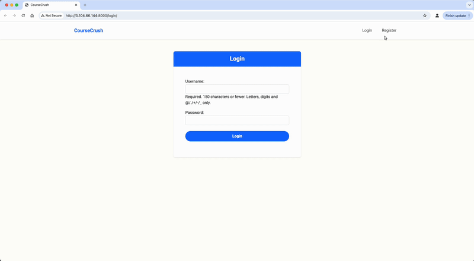
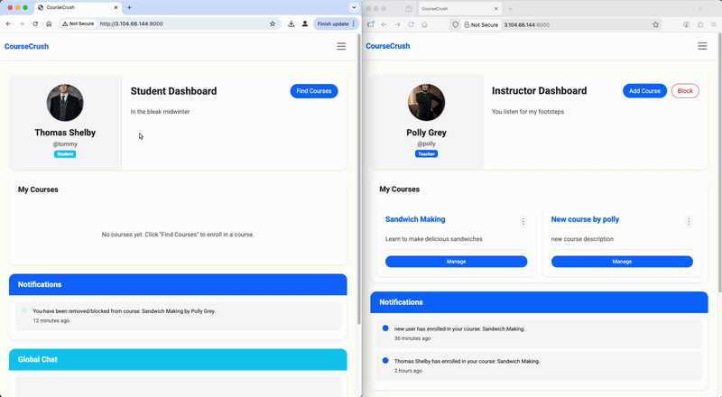

<h1>CourseCrush - eLearning Web Application</h1>
<h2>Overview</h2>
CourseCrush is a web-based eLearning application built with Django to facilitate online learning. It provides a secure and structured platform for interaction between students and teachers. The system supports role-based features, real-time chat, course management, and resource sharing to create a comprehensive and user-friendly learning environment.
  
Key goals of CourseCrush:
<ul>
  <li>Enable secure authentication for students and teachers</li>
  <li>Allow teachers to create courses and upload materials</li>
  <li>Provide students with enrollment, feedback, and real-time communication features</li>
  <li>Support role-based permissions to ensure secure and logical access control</li>
  <li>Integrate notifications for important events like new materials or enrollment changes</li>
</ul>
<h2>Contents</h2>
<ul>
  <li><a href="#features">Features</a></li>
  <li><a href="#Technical Architecture">Technical Architecture</a></li>
  <li><a href="#Implementation Highlights">Implementation Highlights</a></li>
  <li><a href="#Running the Application">Running the Application</a></li>
  <li><a href="#Demo">Demo</a></li>
</ul>
<h2 id="features">Features</h2>
<h3>User Accounts</h3>
<ul>
  <li>Secure registration with role-based access (student/teacher)</li>
  <li>Profile support with full name, role, photo, and status</li>
  <li>Session-based authentication and role validation</li>
</ul>
<h3>Course Management</h3>
<ul>
  <li>Teachers can create, manage, and delete courses</li>
  <li>Students can enroll and withdraw from courses</li>
  <li>Role-based permissions ensure teachers own their courses</li>
</ul>
<h3>Feedback & Interaction</h3>
<ul>
  <li>Students can leave feedback on courses</li>
  <li>Teachers receive notifications for new feedback</li>
  <li>Real-time chat using Django Channels and WebSockets</li>
</ul>
<h3>Learning Materials</h3>
<ul>
  <li>Teachers can upload PDFs, Word documents, and PPTs</li>
  <li>Students can access materials only for courses they are enrolled in</li>
  <li>Role-based validation of file uploads</li>
</ul>
<h3>Notifications</h3>
<ul>
  <li>Students notified of new materials</li>
  <li>Teachers notified when students enroll</li>
  <li>Students notified when blocked/removed from a course</li>
</ul>
<h2 id="Technical Architecture">Technical Architecture</h2>
<h3>Backend</h3>
<ul>
  <li><b>Django & Django REST Framework (DRF)</b>: Core application logic and APIs</li>
  <li><b>Django Channels</b>: Real-time WebSocket support for chat</li>
  <li><b>Redis</b>: Message broker for WebSocket communication</li>
  <li><b>SQLite</b>: Database backend (configurable)</li>
</ul>
<h3>Frontend</h3>
<ul>
  <li>Django templating system with Bootstrap for responsive UI</li>
  <li>Reusable base template for consistent layout</li>
  <li>Minimal custom CSS for styling</li>
</ul>
<h3>Hosting</h3>
<ul>
  <li>Deployed on AWS EC2 (Ubuntu)</li>
  <li>Configured with security groups and background processes using <code>nohup</code></li>
  <li>Accessible via public IP</li>
</ul>
<h2 id="Implementation Highlights">Implementation Highlights</h2>
<h3>1. Role-based Access Control</h3>
<ul>
  <li>Custom user model extending Django’s AbstractUser</li>
  <li>Teachers and students have separate permissions</li>
  <li>Permissions enforced in DRF views and serializers</li>
</ul>
<h3>2. Real-time Communication</h3>
<ul>
  <li>WebSocket chat using Django Channels with Redis as message broker</li>
  <li>ChatConsumer class handles WebSocket connections</li>
  <li>Messages stored in ChatMessage model with recent history delivery</li>
</ul>
<h3>3. Course & Enrollment Management</h3>
<ul>
  <li>Students prevented from double-enrolling or enrolling if blocked</li>
  <li>Teachers can block/remove students dynamically</li>
  <li>Full CRUD operations on course materials</li>
</ul>
<h3>4. Comprehensive Testing</h3>
<ul>
  <li>69 unit tests covering all API endpoints and core functionality</li>
  <li>Factory Boy integration for consistent test data generation</li>
  <li>Role-based permission testing ensuring security boundaries are maintained</li>
  <li>Edge case validation for enrollment, blocking, and file upload scenarios</li>
</ul>
<h2 id="Running the Application">Running the Application</h2>
<ol>
  <li>Clone the repository and unzip the project</li>
  <li>Activate virtual environment:  
    <code>source project-env/bin/activate</code>  
    or create a new one:  
    <code>python -m venv venv && source venv/bin/activate</code></li>
  <li>Install dependencies:  
    <code>pip install -r requirements.txt</code></li>
  <li>Start Redis server:  
    <code>redis-server</code></li>
  <li>Run Django server:  
    <code>python manage.py runserver</code></li>
  <li>Access the app at <b>http://127.0.0.1:8000/</b></li>
</ol>
<h2 id="Demo">Demo</h2>
<h3>Hosted Demo</h3>

The application is hosted on AWS EC2 and can be accessed here:  
<a href="http://3.104.66.144:8000" target="_blank">http://3.104.66.144:8000</a>

<h3>Authentication</h3>
<table>
  <tr>
    <td align="center">
      
    </td>
  </tr>
</table>
<h3>Student Account</h3>
<ul>
  <li>View courses and users on explore page</li>
  <li>Enroll into course</li>
  <li>See course material and leave a review</li>
</ul>
<table>
  <tr>
    <td align="center">
      
    </td>
  </tr>
</table>
<h3>Teacher Account</h3>
<ul>
  <li>Create and add new course and material</li>
  <li>Block students</li>
</ul>
<table>
  <tr>
    <td align="center">
      
    </td>
  </tr>
</table>
<h3>Live Chat</h3>
<table>
  <tr>
    <td align="center">
      
    </td>
  </tr>
</table>
